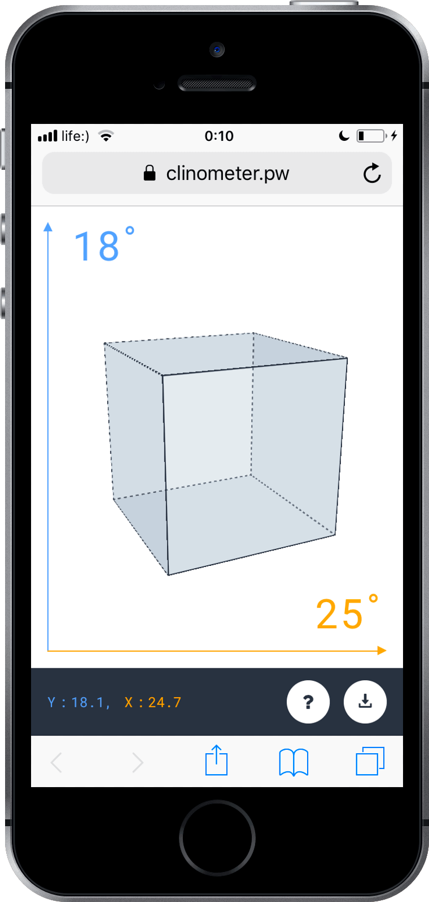
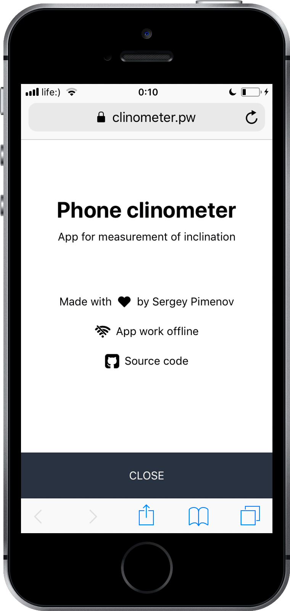

### Simple mobile clinometer progressive web application (PWA)

&nbsp;

Weekend debut PWA. Offline ready, installable and simple.

Builded for exploring *service workers*, *promises*, *deviceorientation API* and other modern  API's for building PWA.

&nbsp;

&nbsp;

   &nbsp;&nbsp;&nbsp; &nbsp;
   &nbsp;&nbsp;&nbsp; &nbsp;
  

&nbsp;

  <a href="https://clinometer.pw/"><strong>Link to the app<strong></a>

&nbsp;

&nbsp;

&nbsp;

***

  Created with ♥ by <a target="_blank" href="https://sergey-pimenov.github.io">Sergey Pimenov</a>

***